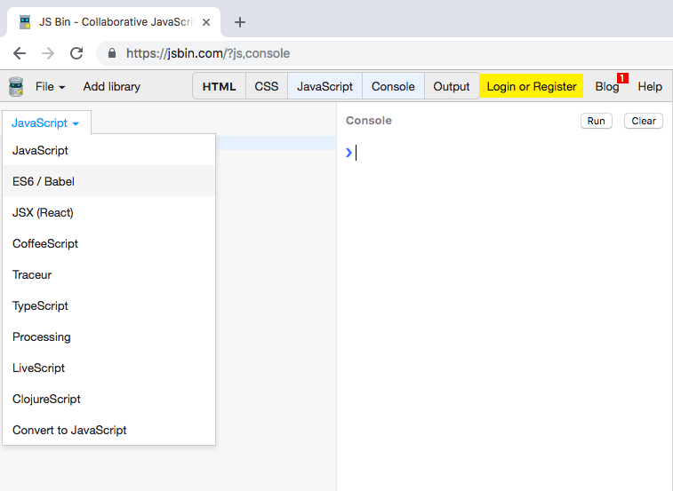

# JavaScript as ES.next
## 本書について
本書は、JavaScriptにおけるECMAScriptの2015以降の仕様(ESNext)の紹介用として作成されています。特にES2015の初心者向けにかかれています。紹介している内容は、覚えておくとよいと思われるものを筆者目線で書かれているため、すべてを網羅していないので注意してください。

## ESNextの動作環境と注意点
ESNextの文法を使って開発をする場合、動作を予定する環境のサポート状況を確認しましょう。ブラウザやブラウザのバージョン、Node.jsのバージョンによってサポート状況が変わります。

例えば、関数の`デフォルト引数`のサポート状況は以下のとおりです。
- [ブラウザ](https://developer.mozilla.org/ja/docs/Web/JavaScript/Reference/Functions/Default_parameters#Browser_compatibility)
- [Node.js](https://node.green/#ES2015-syntax-default-function-parameters)

### Babelとは
ESNextを使いたい場合、[Babel](https://babeljs.io/)と呼ばれるコンパイラを利用できます。ESNextな文法を使って書いたJavaScriptをBabelにより、`動作環境に依存しないJavaScript`に変換することができます。

### ESNextを実行できる環境
JavaScriptを手軽に実行できるクラウドサービスがいくつかあります。それらを使ってESNextを書きたい場合、Babelなどがオプションとして用意されていることがあります。

JS Binというサービスの場合、画面左上にて`ES6/Babel`という選択が可能です。  
[https://jsbin.com/?js,console](https://jsbin.com/?js,console)

## 目次
* [letとconst](./docs/let-and-const.md)
* [アロー関数](./docs/arrow-function.md)
* [分割代入](./docs/destructuring-assignment.md)
* [スプレッド構文](./docs/spread-syntax.md)
* [Arrayメソッド](./docs/array-methods.md)
* [覚えておきたい構文など](./docs/new-specifications.md)
